sebuah vektor
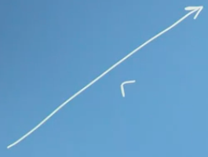
nilai yang memiliki arah. jika berlawanan itu akan menjadi -r
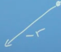

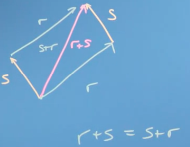

pergerakan dapat ditulis sebagai matrik
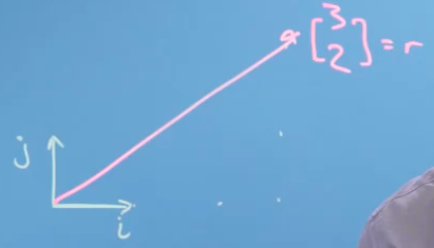

> 3 (atas) sebagai X, dan 2 (bawah) sebagai Y

itu mirip dengan koordinat kartesius
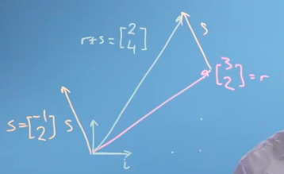

jadi ketika kita mengalikan sebuah vektor, akan seperti perpanjangan
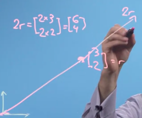

ketika vektor merupakan inverse, maka jika dijumlahkan menghasilkan angka 0. 

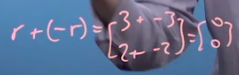

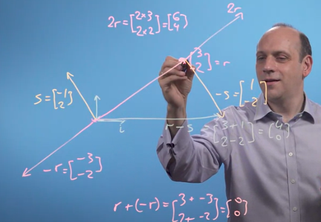

***
kita dapat menerapkan vektor ke berbagai bidang, misalnya untuk perhitungan rumah
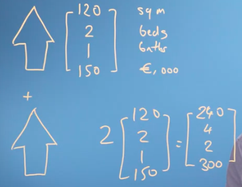

***

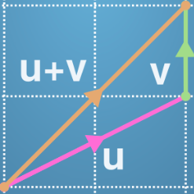
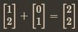