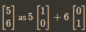
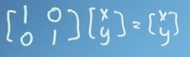
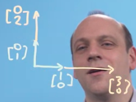
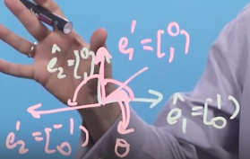

Sifat Operasi aritmatika matrik tidak sepenuhnya sama dengan aritmatika riil

matrik identitas kalau gak salah namanya, ketika di ilustrasikan adalah sebagai berikut

ketika sebuah matrik tersebut dirotasikan 90 derajat clockwise, maka elemen-elemen dalam matrik tadi dapat berubah. kurang lebih seperti gambar dibawah ini

