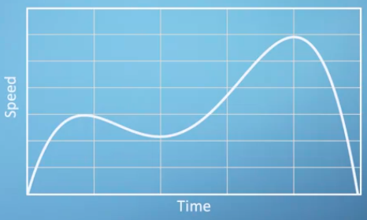
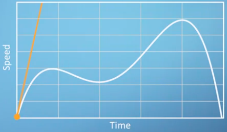
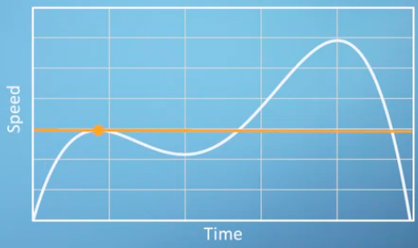

diatas merupakan grafik yang merepresentasikan kecepatan mobil yang tidak konstant dengan inisial kecepatan adalah nol. dengan kalkulus kita dapat mengekstrak much more than just speed. 

essense of calculus, its slope at every point conatructing a new function, which is its derivative