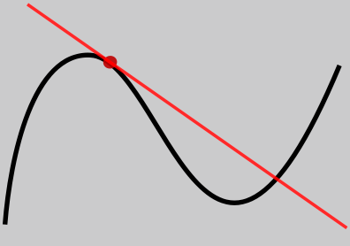

Misalnya saya melempar batu, dengan kecepatan awal 20m/s. dengan resistensi udara yang membuat batu tersebut selalu mengalami penurunan kecepatan 1m/s. berapa km batu tersebut telah terlempar dalam waktu 3 s? jika gravitasi diabaikan

> jika anda menalar jawabanya adalah 57 meter!
> mari kita buktikan turunan

	v(t) = v0 - a*t
	
di mana `v0` adalah kecepatan awal benda dan `a` adalah **percepatan** (bernilai negatif, karena resistensi udara mengurangi kecepatan benda). 

kemudian rumus tersebut diturunkan terhadap `t`

	s(t) = ∫ v(t) dt
  	     = ∫ (v0 - a*t) dt
   	     = v0*t - 1/2*a*t^2 + C
	     = v0*t - 1/2*a*t^2
		 
Kita dapat menggunakan persamaan ini untuk mencari jarak yang ditempuh oleh batu dalam waktu 3 detik.

	s(3) = v0*3 - 1/2*a*(3^2)
		= 20*3 - 1/2*1*(9)
		= 57 meter

*Bagaimana jika saya langsung menggunakan persamaan v(t) = v0 - a*t *untuk mencari posisi benda pada waktu 3 detik? sehingga persamanya menjadi v(3) = 20 - 1*3 ?*

jawab: Anda akan mendapatkan kecepatan benda pada saat 3 detik, bukan posisi benda.

***
### Turunan memberikan informasi grafik fungsi

Secara khusus, turunan suatu fungsi pada titik tertentu memberikan kemiringan garis tangen pada titik tersebut. Turunan juga digunakan untuk mencari nilai maksimum atau minimum fungsi.

Dalam hal ini, fungsi yang diberikan adalah f(x) = x^2 + 2x, dan turunannya adalah f'(x) = 2x + 2. Ini berarti bahwa pada setiap titik x, kemiringan garis tangen pada titik tersebut adalah 2x + 2.

Contohnya, jika kita ingin mencari kemiringan garis tangen pada titik x=3, kita dapat menghitung nilai f'(3) = 2(3) + 2 = 8. Ini berarti bahwa garis tangen pada titik x=3 memiliki kemiringan sebesar 8.

Selain itu, turunan juga dapat digunakan untuk mencari nilai maksimum atau minimum fungsi. Untuk mencari nilai ini, kita dapat mencari titik-titik di mana turunan suatu fungsi sama dengan nol. Dalam kasus ini, untuk mencari nilai maksimum atau minimum dari fungsi f(x) = x^2 + 2x, kita perlu mencari titik-titik di mana f'(x) = 0. Dari f'(x) = 2x + 2, kita dapat menyelesaikan persamaan 2x + 2 = 0, yang menghasilkan x = -1.

Maka, titik x=-1 adalah titik stasioner dari fungsi f(x) = x^2 + 2x. Untuk menentukan apakah ini adalah nilai maksimum atau minimum, kita dapat menggunakan turunan kedua, f''(x) = 2, di mana f''(-1) = 2. Karena f''(-1) adalah positif, maka titik x=-1 adalah titik minimum lokal dari fungsi f(x) = x^2 + 2x.
***
### turunan menunjukkan laju perubahan fungsi
Secara intuitif, turunan pada titik tertentu memberikan kemiringan garis tangen pada titik tersebut. Kemiringan ini dapat diinterpretasikan sebagai laju perubahan fungsi pada titik tersebut.

Sebagai contoh, jika turunan f'(3) = 8, maka ini berarti bahwa pada titik x=3 (pada fungsi), fungsi tersebut sedang mengalami perubahan sebesar 8 unit pada setiap perubahan satu unit pada sumbu x.