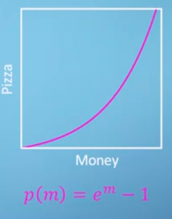
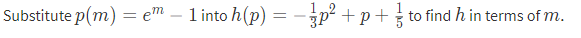
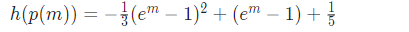
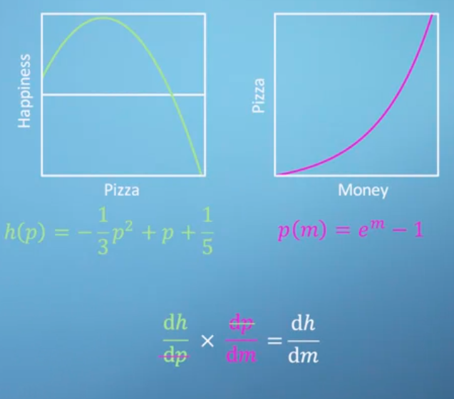
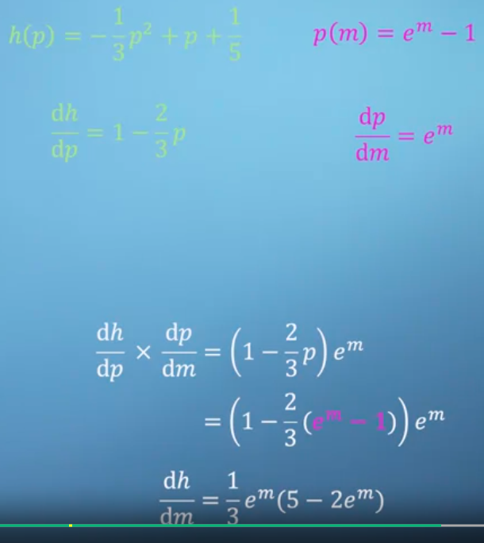
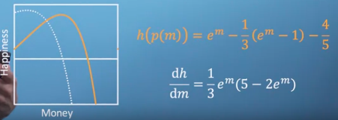

Chain rule adalah aturan untuk menghitung turunan dari fungsi yang kompleks, di mana fungsi tersebut terdiri dari fungsi luar dan fungsi dalam (inner function). Aturan ini dinyatakan sebagai berikut:

Jika h(x) = f(g(x)) adalah fungsi kompleks yang terdiri dari fungsi luar f dan fungsi dalam g, maka turunan dari h(x) adalah:

h'(x) = f'(g(x)) * g'(x)

Dalam kata lain, aturan ini memberikan cara untuk menghitung turunan dari fungsi kompleks dengan mengalikan turunan dari fungsi luar dengan turunan dari fungsi dalam, kemudian mengganti variabel dalam turunan fungsi luar dengan fungsi dalam.

***
berikut adalah contohnya, sebuah fungsi A yang berada didalam fungsi B

diatas merupakan representasi dari seseorang yang memakan cukup pizza maka kebahagiaanya akan meningkat, tetapi jika makan banyak pizza maka kebahagianya akan turun. hal tersebut dikarenakan pizza yang banyak membuat uangnya habis seperti pada grafik dibawah ini. 

dalam grafik diatas, ketika anda memiliki banyak uang, maka pizza yang anda beli meningkat secara eksponensial (karena diskon). 

 ini jawabanya: 
secara empiris dituliskan sebagai berikut:

