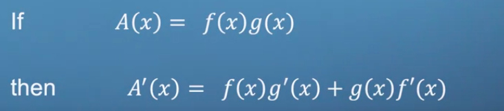

untuk product rule dan chain rule sepertinya pernah diajarkan di sekolah guys

# Turunan dua fungsi

Product rule adalah aturan untuk menghitung turunan dari hasil kali (product) dua atau lebih fungsi. Aturan ini dinyatakan sebagai berikut:

Jika f(x) dan g(x) adalah dua fungsi yang dapat diturunkan, maka turunan dari f(x) * g(x) adalah:

(fg)' = f'g + g'f

Dalam kata lain, aturan ini memberikan cara untuk menghitung turunan dari hasil kali dua fungsi, yaitu dengan mengalikan turunan dari fungsi pertama dengan fungsi kedua dan turunan dari fungsi kedua dengan fungsi pertama, kemudian menjumlahkan keduanya.

Product rule dan chain rule adalah aturan yang sangat penting dalam kalkulus karena mereka membantu kita menghitung turunan dari fungsi-fungsi yang lebih kompleks, yang sering ditemukan dalam berbagai aplikasi matematika, fisika, dan teknik.