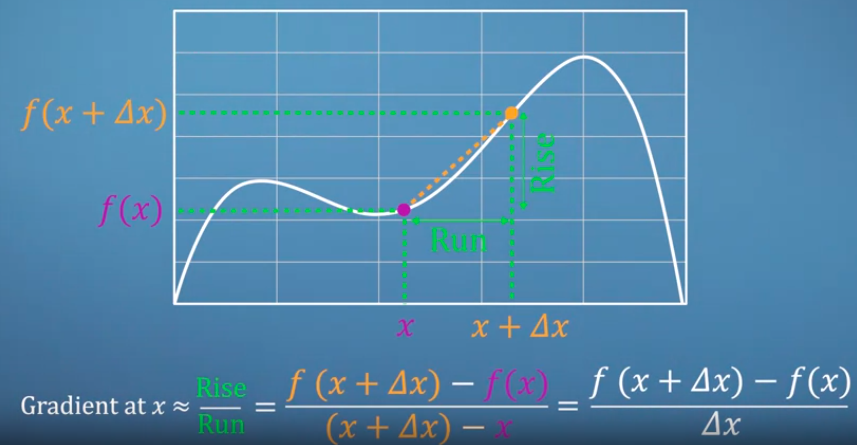
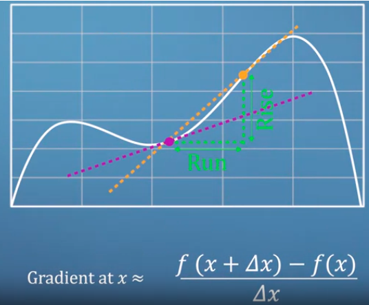
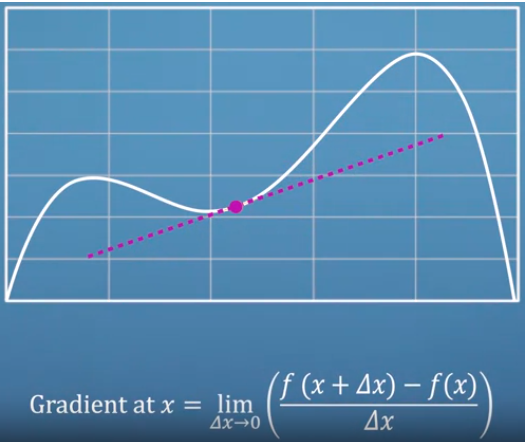
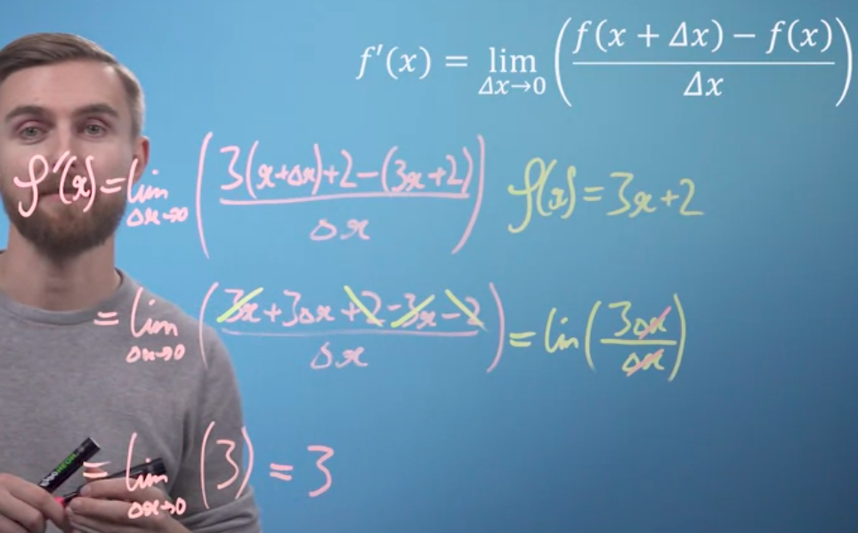
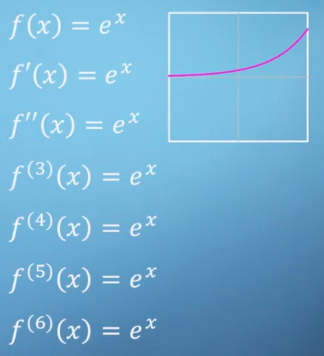
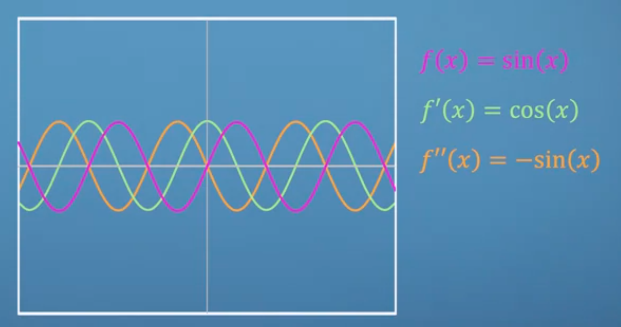
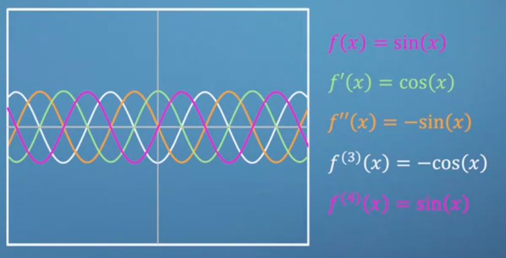

kedua titik orange dan ungu didekatkan sampai dengan mendekati nol (limit 0) untuk mendapatkan perkiraan yang lebih baik. 

seperti ini cara menghitung differential

 simplify : 
bisa juga mengguakan cara cepat yang diberikan di bangku sekolah. 

***
Special function is eular number

euler number is very important to calculus seperti halnya nilai phi. salah satu yang membuatnya unik adalah seberapun kita menurunkanya, tidak akan ada perubahan nilainya. 

## Sin and Cosin

Turunan dari fungsi sinus adalah kosinus, sedangkan turunan dari fungsi kosinus adalah negatif dari sinus. Jika kita mengetahui turunan dari fungsi sinus atau kosinus, maka kita dapat dengan mudah menghitung turunan dari fungsi kosinus atau sinus.

apabila kita menurunkan sampai dengan 4 kali, akan didapatkan sin lagi

