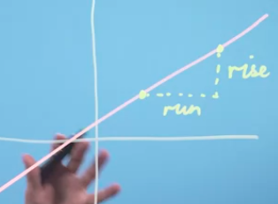
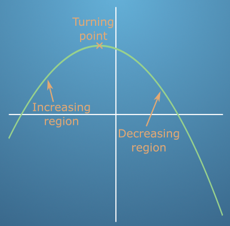
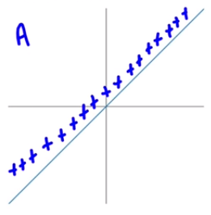
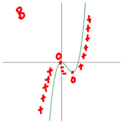
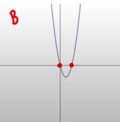
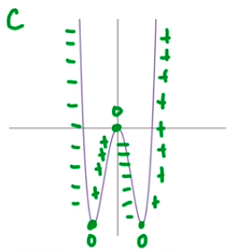
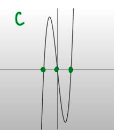
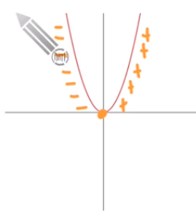
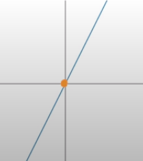

"Rise over run" mengacu pada perbandingan antara kenaikan (rise) dan jarak horizontal (run) dalam segitiga siku-siku. Dalam kalkulus, istilah ini sering digunakan untuk menjelaskan konsep gradien atau kemiringan (slope) dari sebuah garis. Gradien atau kemiringan adalah perubahan vertikal (rise) dibagi dengan perubahan horizontal (run) pada garis.

Dalam kalkulus, gradien seringkali digunakan untuk menghitung turunan, yaitu seberapa banyak suatu fungsi berubah pada titik tertentu. Oleh karena itu, istilah "rise over run" dapat dikaitkan dengan kalkulus melalui konsep gradien dan turunan.

On the right there is a region where the function is decreasing, so the gradient  and derivative would are negative. 

On turning point, where the gradient is exactly 0 at a specific value of x
 ***
### derivative is the slope of the tangent line
turunan adalah kemiringna garis singgung. kita dapat menggunakan turunan untuk menghitung kemiringan garis singgung pada suatu titik pada kurva.

merujuk pada perubahan nilai fungsi **saat titik tersebut bergerak dengan nilai yang sangat kecil**, atau mendekati nol, pada sumbu x.

**Jika turunan positif** pada suatu titik, maka nilai fungsi cenderung meningkat pada titik tersebut. Sebaliknya, **jika turunan negatif** pada suatu titik, maka nilai fungsi cenderung menurun pada titik tersebut. **Jika turunan sama dengan nol pada suatu titik**, maka titik tersebut mungkin merupakan titik maksimum atau minimum pada fungsi.

## #contoh 1
Function

Derivatives

pada fungsi bahwa, grafiknya terus mengalami peningkatan (Increasing), maka dalam turunanya ia harus merepresentasikan nilai positif. f(x) = y | f'(x) disini yang diperhatikan adalah sumbu Y. dalam fungsi ia dikatakan mengalami increasing atau decreasing didasarkan pada sumbu y. dan dalam turunan kalau ia ingin merepresentasikan nilai positif, maka ia harus berada pada koordinat positif terhadap sumbu Y, seperti pada gambar diatas. 

## #contoh 2
Function

Derivatives

dalam grafik fungsi, (membaca dari kiri ya) ia mengalami **1) increasing**, kemudian sampai pada **2) titik stasioner** (puncak) yang ketika diturunkan pada titik itu nilainya adalah 0. setelah itu mengalami **3) decreasing** dan bertemu **4) titik stasioner lagi** yang ketika diturunkan pada titik itu nilainya adalah 0. setelah itu mengalami **5) increasing** lagi. 

dalam grafik turunanya, itu sudah mencerminkan nilai. dimana kronologinya
1. increasing maka dalam grafik turunan ia ada di nilai positif terhadap sumbu y (tidak peduli berapa nilainya, yang penting positif)
2. stasioner, maka dalam grafik turunan ia berada pada titik 0 terhadap sumbu y
3. decreasing maka dalam grafik turunan ia ada di nilai negatif terhadap sumbu y (tidak peduli berapa nilainya. yang penting negatif)
4. stasioner, maka dalam grafik turunan ia berada pada titik 0 terhadap sumbu y
5. increasing makaa dalam grafik turunan ia ada di nilai positif terhadap sumbu y (tidak peduli berapa nilainya, yang penting positif)

## #contoh 3
Function

Derivatives

## #contoh 4
Function 

Derivatives

fakta : jumlah titik stasioner selalu sama jumlanya dengan garis yang menyentuh nilai 0 terhadap sumbu y dalam grafik turunanya.

fakta : grafik turunanyang merepresentasikanya mungkin bisa bervariasi