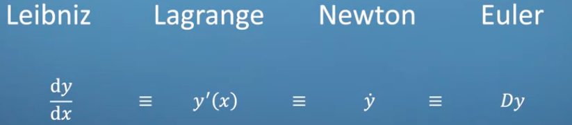
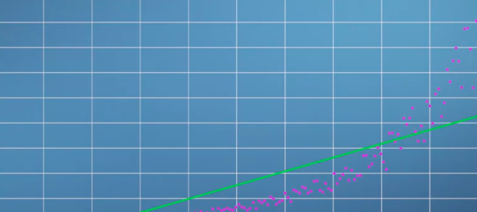
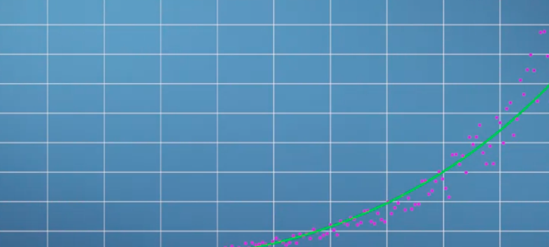
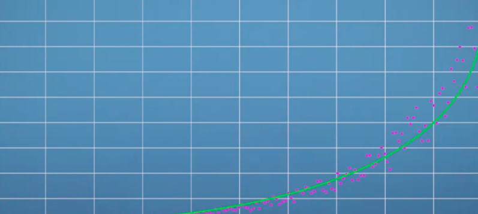
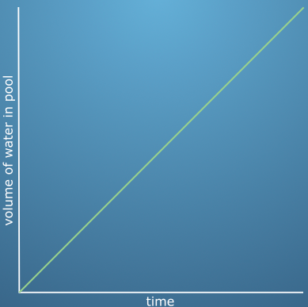
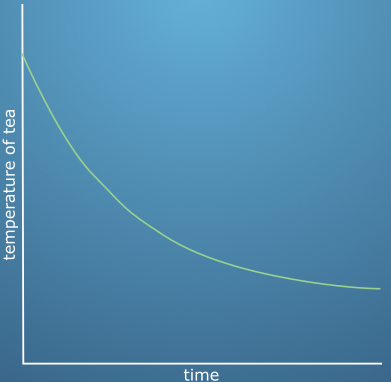
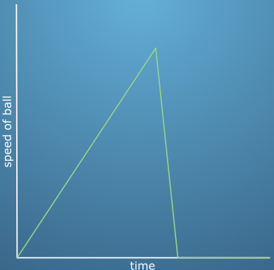
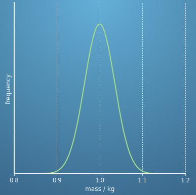
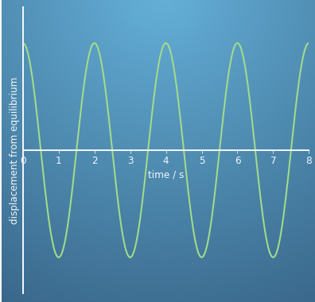

Function adalah hubungan antara input dan output. Fungsi dapat diberikan operasi matematika padanya, salah satunya yaitu turunan, jadi Turunan bukanlah sebuah fungsi, melainkan suatu operasi matematika yang diterapkan pada suatu fungsi

dibawah ini adalah notasi yang merepresentasikan

dibawah ini dinamakan memilih fungsi yang paling merepresentasikan

thath selecting function is creative essence of science. 

### Calculus
Kalkulus adalah studi mengenai bagaimana fungsi berubah sehubungan dengan variabel input mereka dan memungkinkan Anda untuk menyelidiki dan memanipulasinya

Teh yang mendingin seiring waktu 

Bola jatuh dari atas yang menghantam tanah

Distribusi berat apel dengan rata-rata 1kg

Pendulum tanpa resistensi yang bergerak utuh dalam 2 detik