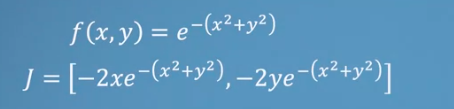
Jacobian menampung masing masing dari turunan parsial seperti pada gambar diatas. apabila diberikan suatu input, maka akan dapat divisualisasikan kedalam koordinat kartesian:
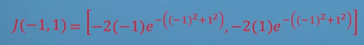
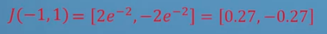
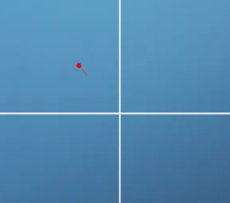

kemudian kita memasukkan beberapa nilai
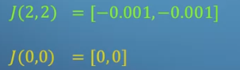
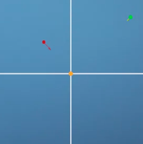
input dengan 0 dinamakan dengan `saddle` dimana titik tersebut merupakan maximum of the system
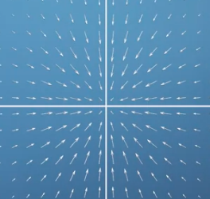
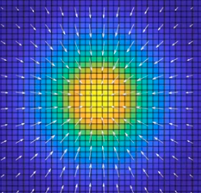
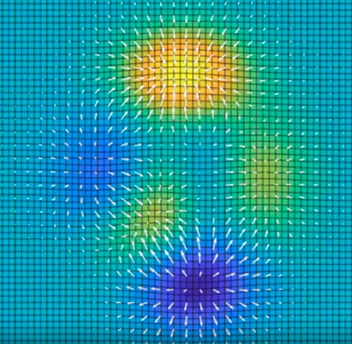
semakin tinggi warnanya, merepresentasikan nilai yang tinggi. dalam 3D dibawah ini
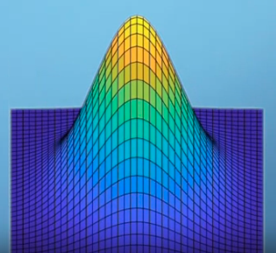

apabila kita memiliki dua fungsi. keduanya dapat digabungkan menjadi jacobian dengan matriks
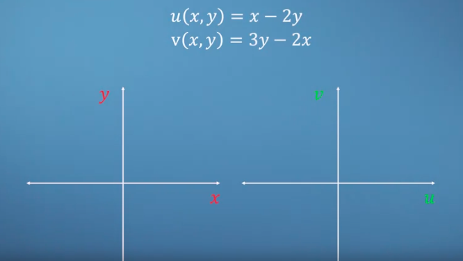
| du/dx du/dy |
| dv/dx dv/dy |

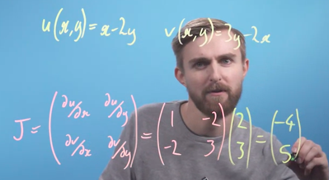
seperti ituu...
***
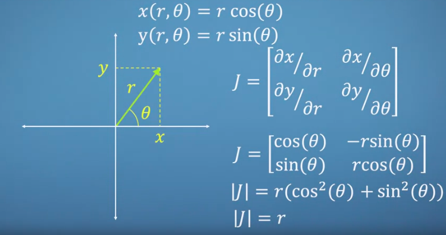

## Sandpit
Sandpit adalah teknik visualisasi yang digunakan untuk memvisualisasikan perubahan fungsi dalam dimensi yang lebih tinggi dengan memetakan perubahan fungsi ke dalam grafik yang lebih mudah dipahami. 

# Hessian
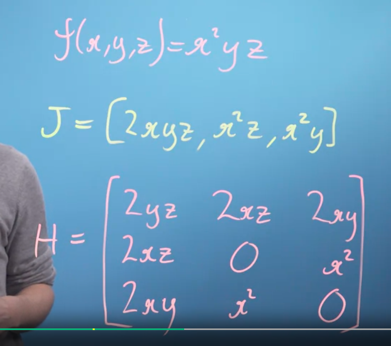

adalah matrik diagonal (nxn) yang mengandung turunan kedua, atau jacobians yang diturunkan lagi. (sepertinya agak kurangn nyimak)

Hessian digunakan dalam analisis multivariabel untuk mempelajari sifat-sifat fungsi, seperti titik kritis (maksimum dan minimum lokal)