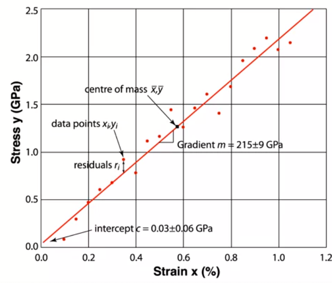

jika anda memiliki dataset, dan ternyata dalam kolom data ada yang hilang, untuk mengurangi bias, anda dapat menggunakan regresi linear untuk memperkirakan berapa yang sebaiknya anda karang dalam kolom yang kosong tadi. 