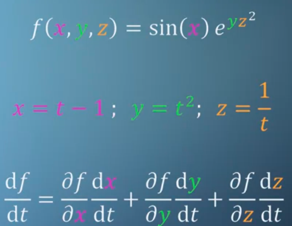
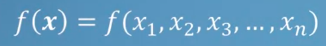
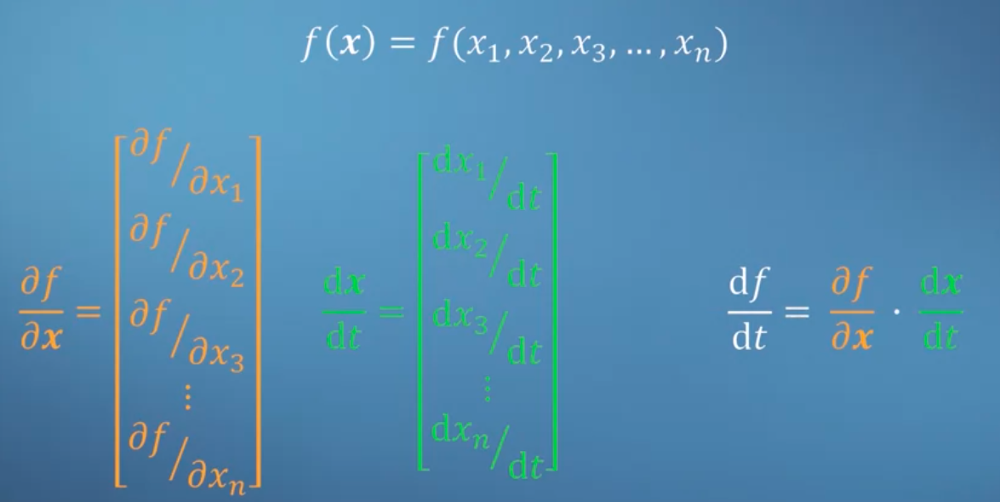
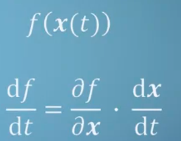
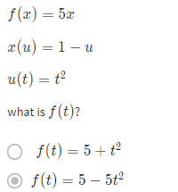
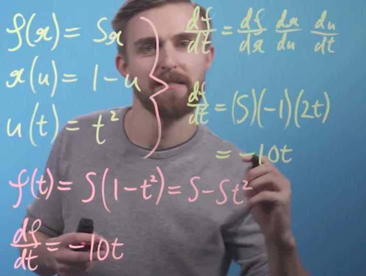
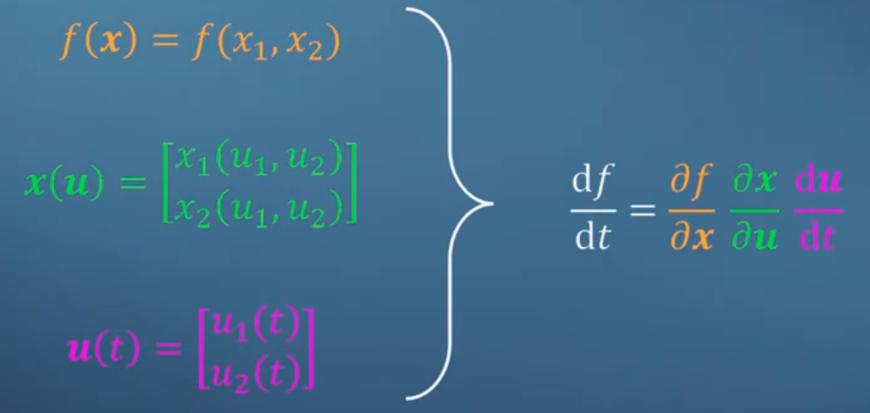
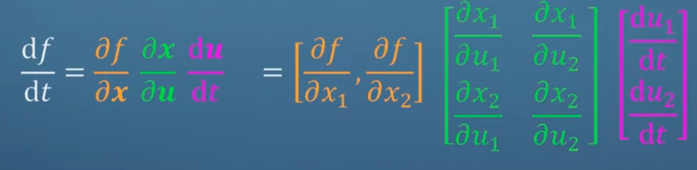

sebelumnya telah dibahasa multivatriate turunan parsial normal.

sekarang menggunkan chain rule, dimana chain rule anda akan menemukan juga di bab fungsi. 

bentuk umumnya seperti ini guys

# More on multivariate chain rule

anda memisahkannya satu satu dahulu fungsinya

turunan f terhadap t

dibawah adalah dimensi matrik yang merepresentasikanya
