Neural Newtork menunjukkan bagaimana pentingnya multivariate. ia bisa digunakan untuk image recognition. Neural Network sebenarnya adalah fungsi matematika yang mengambil suatu variabel dan mengambelikan suatu variabel. kedua variabel tersebut adalah suatu vektor. 
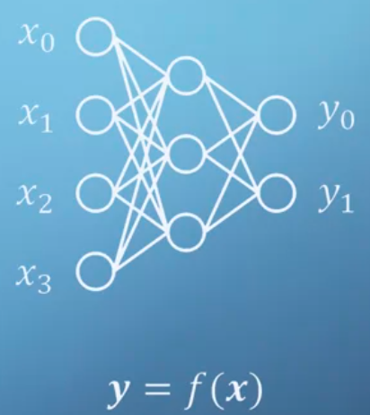

## Neural simpel
dibawha ini satu network dijelaskan
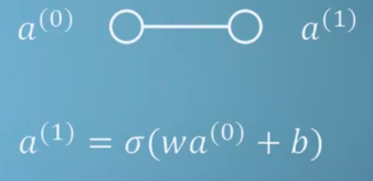
dimana w dan b adalah suatu konstanta dan sigma adalah fungsi. 
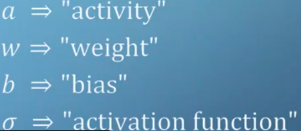

> Sigma that gives neural networks theri association to the brain.

neuron dalam otak menerima informasi dari senyawa tetangga dan simulasi elektrika. dan ketika total dari simulasi melampaui ambang batas tertentu, neuron akhirnya teraktivasi untuk mensimulasi neuron lainya

ketika neuron bertambah, mereka saling dihubungkan dengan weight (w)
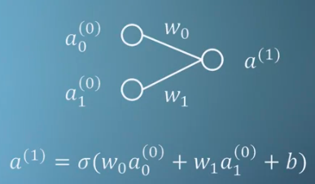
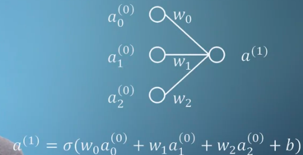
jika disederhanakan rumusnya menjadi seperti ini
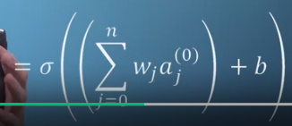

sepertin dibawah ini tampak bagaimana vektor disimpan dalam matrik
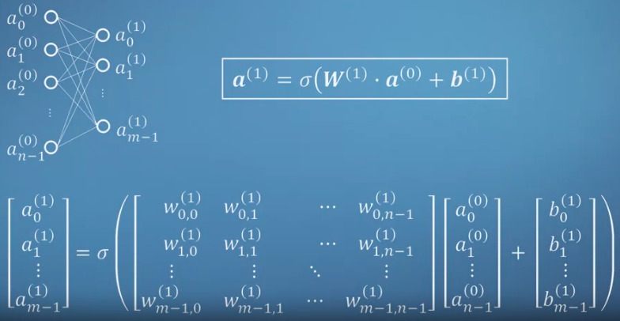

### satu layer
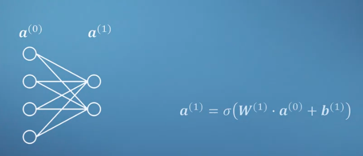
### dua layer
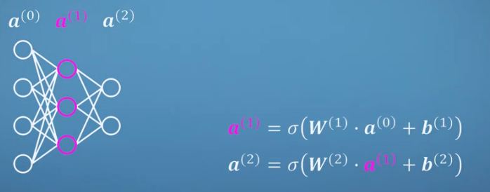

***
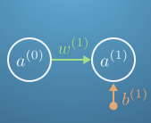

aktivasi neuron pada layer final ditentukan oleh aktivasi dari neuron sebelumnya. 
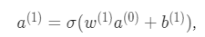
dimana w(1) adalah weight dari koneksi antar neuron, dan b(1) adalah bias dari neuron (1). kemudian mereka diberikan fungsi aktivasi, sigma, yang memberikan aktivasi kepada neuron (1). Our small neural network won't be able to do a lot - it's far too simple

Let's assume we want to train the network to give a NOT function, that is if you input 1 it returns 0, and if you input 0 it returns 1.

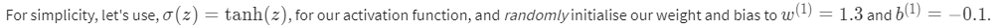
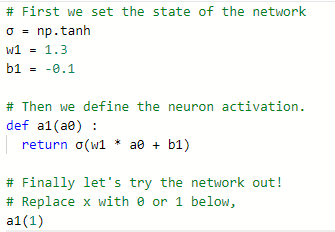
hasilnya adalah : 0.833654607012 dan -0.885351648202 untuk input -1. (ini salah ya bukan NOT Function, tapi intinya seperti itu)

Mari kita tambah jaringan syarafnya
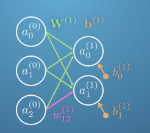
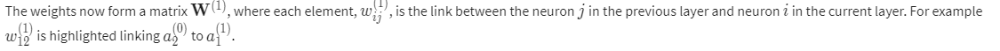

sehingga fungsi untuk beberapa neuron menjadi sepertin ini 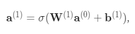

nilai-nilai input dapat ditampung dalam matrik seperti dibawah ini
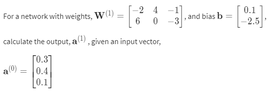

***

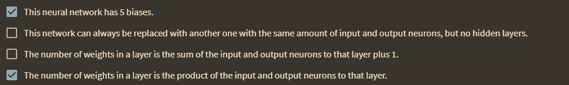
rumusnya sepertin in 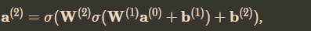

instrument neural network
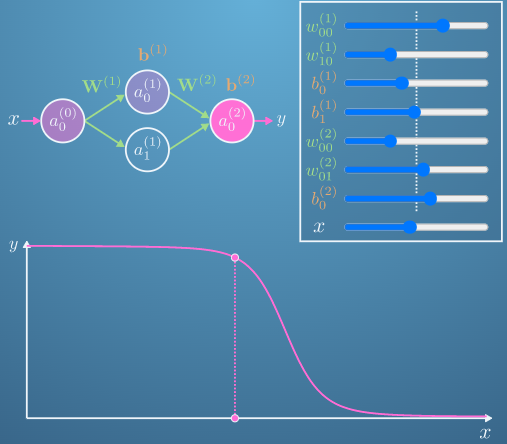