misalnya NN untuk rekognisi wajah
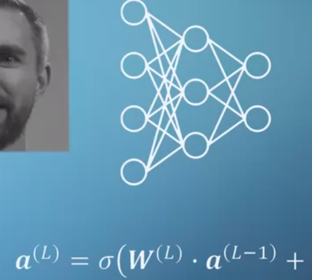
inputnya mungkin adalah intensitas dari setiap piksel gambar. 
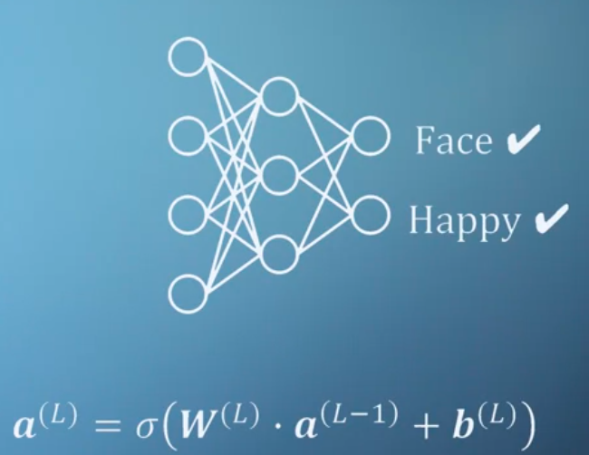

training ini dinamakan dengan propagasi. 

cost function. ini mengukur perbedaan bagaimana nilai (weight) hasil training dan nilai (weight) yang akan diprediksi (untraining)
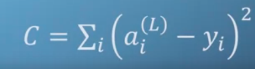
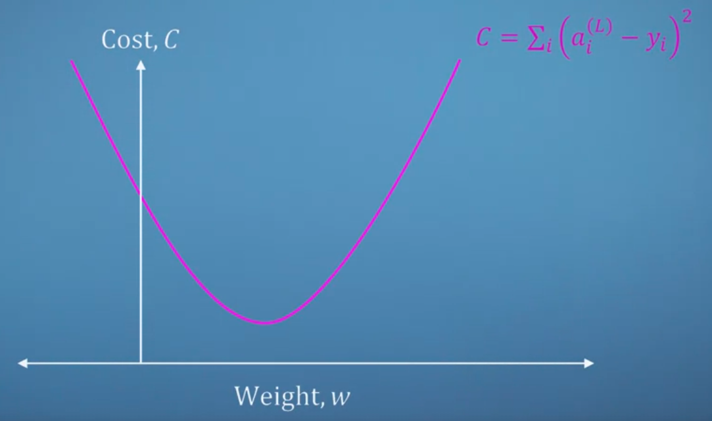
mari mengingat materi kalkulus
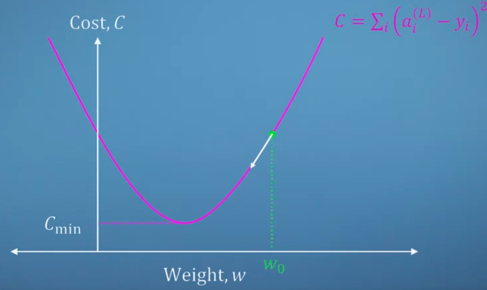
Cmin itu adalah yang terdekat dengan weight (hasil training). maka sebuah titk itu (hijau) dapat kita ketahui bagaimana lokasi. dengan diturunkan, kita akan tahu kemiringanya dan nilainya (positif atau negatif) ya kan dengan alat itu kita bisa melakukan operasi pada titik itu untuk mengetahui apa yang seharusnya dilakukan untuk mencapai Cmin. dan apabila kita itu telah di Cmin (global minima) turunanya akan menghasilkan 0.  

dalam keadaan nyata sangat jarang ditemukan grafik seperti diatas, akan sering menemukan yang seperti ini
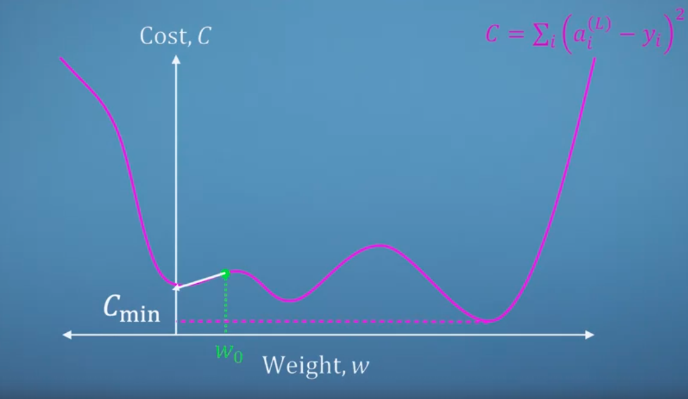
ada local minima dan global minima, isolated weight. 

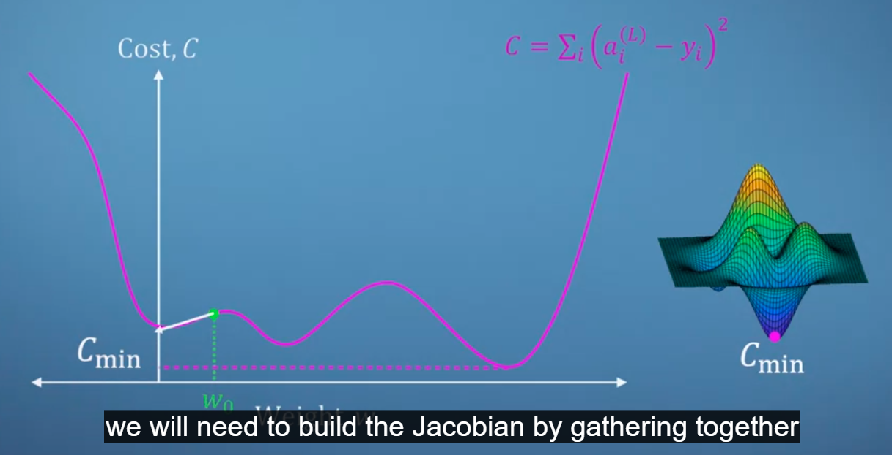
untuk seperti itu, jika kita ingin turun gunung 'we will need to build the jacobian by gathering together the partial derivatives of the cost function with respect to all relevant variable'.

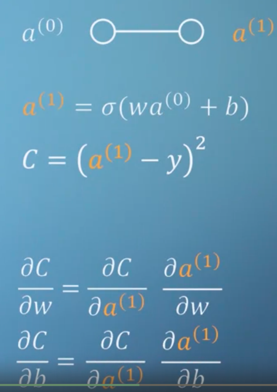
itu menerapkan chain rule. back-propagation, using the chain rule, in order to train our neural networks.

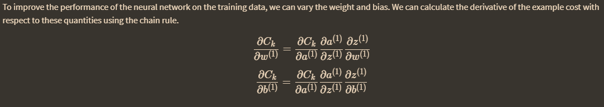

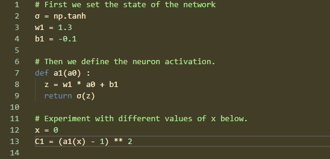

File Contoh Neural Netork menggunakan traingin propagasi ada di : `D:\dokumen\Academic\Pemograman\python\Neural Network`

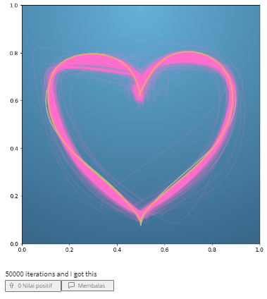