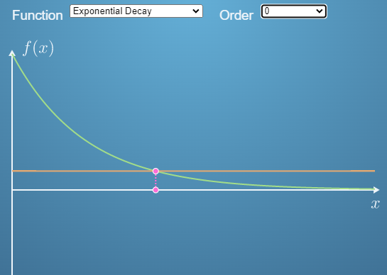
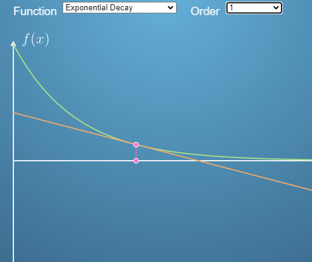
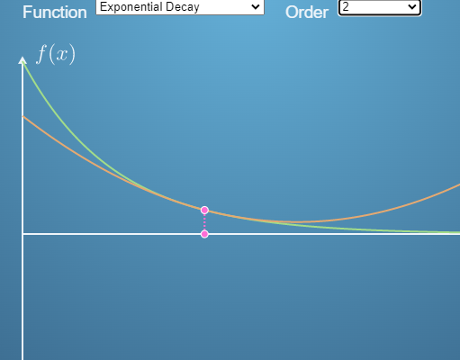
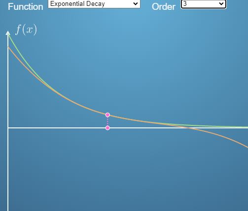
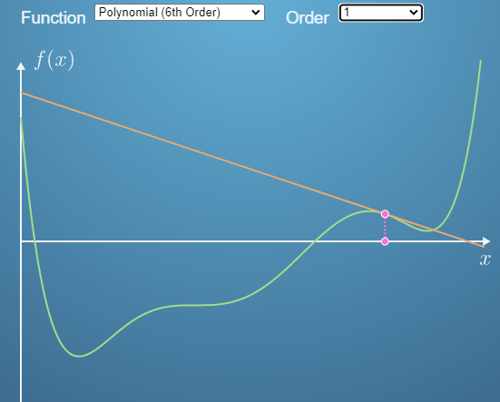
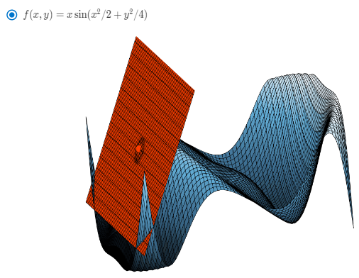

Taylor series adalah suatu representasi fungsi matematika sebagai jumlah tak hingga dari turunan-turunan fungsi tersebut pada suatu titik tertentu dalam bentuk deret tak terhingga. Representasi ini dikenal juga sebagai ekspansi Taylor atau deret Taylor.

Deret Taylor sering digunakan dalam analisis matematika dan fisika, serta digunakan dalam berbagai aplikasi dalam bidang teknik dan sains. Deret ini memungkinkan kita untuk memperkirakan nilai fungsi pada titik lain dalam interval tertentu, atau untuk mendekati fungsi dengan fungsi polinomial yang lebih sederhana.

[...aku skip...]

orde 0

orde 1

orde 2

orde 3

orde 1 pada fungsi polinomial

Taylor Series 2D
