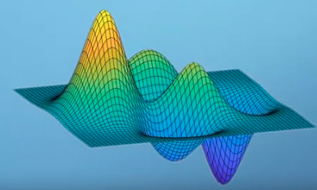
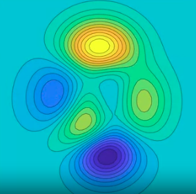
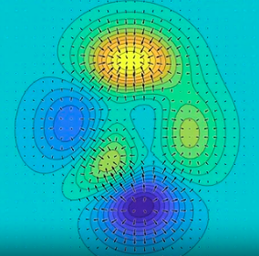

Setiap elemen dalam matriks Jacobian merupakan turunan parsial fungsi vektor f terhadap variabel inputnya.

Jacobian sering digunakan dalam berbagai aplikasi, seperti dalam perhitungan transformasi koordinat pada sistem koordinat yang berbeda, dalam analisis numerik untuk menyelesaikan persamaan diferensial parsial, dan dalam optimasi

