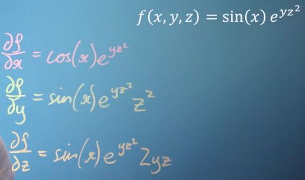
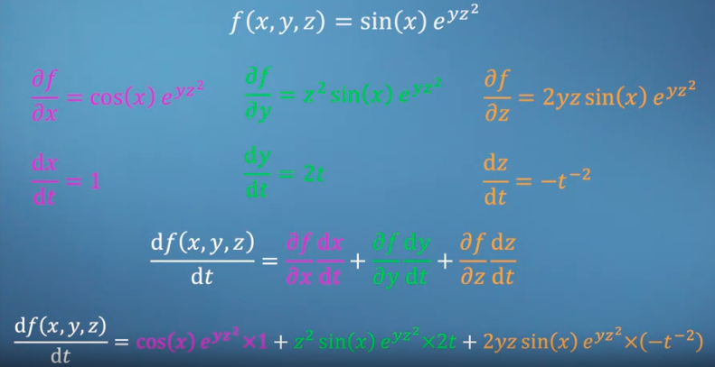

Turunan parsial adalah turunan dari suatu fungsi multivariat terhadap salah satu variabelnya sementara variabel lainya dianggap konstan. 
notasinya, jika f(x,y) adalah sebuah fungsi dua variabel. 
turunan parsial f terhadap x dituliskan ∂f/∂x
turunan parsial f terhadap y dituliskan ∂f/∂y
turunan parsial dihitung dengan cara yang sama seperti turunan biasa. 

***
berikut adalah contoh turunan parsial terhadap fungsi trigonometri

mereka diturunkan masing-masing pada setiap variabel dengan variabel lain konstan. sehingga kita mempunyai tiga turunan parsial. 

ketika semua turunan parsial kemudian diturukan terhadap 

***
#### Contoh lain
Salah satu contoh aplikasi turunan parsial adalah dalam menghitung gradien atau laju perubahan suatu fungsi multivariabel di titik tertentu.

Misalnya, diberikan fungsi f(x,y) = x^2 + 3xy + 2y^2. Kita ingin mencari gradien dari fungsi ini di titik (1,2), yaitu vektor yang menunjukkan arah dan kecepatan perubahan terbesar dari fungsi tersebut di titik tersebut.

Untuk menghitung gradien, kita perlu menghitung turunan parsial fungsi f(x,y) terhadap masing-masing variabel, yaitu ∂f/∂x dan ∂f/∂y. Turunan parsial ∂f/∂x adalah:

∂f/∂x = 2x + 3y

Turunan parsial ∂f/∂y adalah:

∂f/∂y = 3x + 4y

Kita dapat menghitung gradien dari f di titik (1,2) dengan menggabungkan kedua turunan parsial tersebut menjadi vektor:

∇f(1,2) = (∂f/∂x(1,2), ∂f/∂y(1,2)) = (2(1) + 3(2), 3(1) + 4(2)) = (8, 11)

Jadi, gradien dari f di titik (1,2) adalah vektor (8,11), yang menunjukkan bahwa fungsi f mengalami kenaikan yang relatif besar dalam arah (8,11) di sekitar titik (1,2).