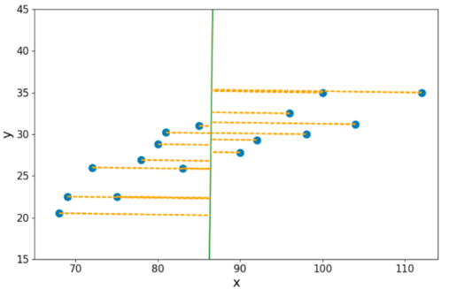
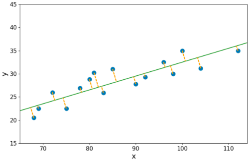
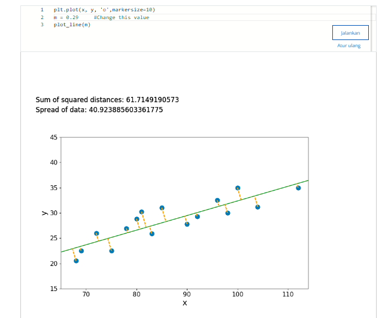

dari yang dibawah ini

agar slope mengurangi error, yaitu seperti ini yang didambakan

Dalam persamaan garis, nilai m mewakili kemiringan (slope) garis tersebut. Jadi, untuk membuat garis menjadi miring, kita harus menetapkan nilai m yang bukan nol.

Secara umum, persamaan garis dapat ditulis sebagai y = mx + b, di mana m adalah kemiringan garis, dan b adalah perpotongan sumbu y.

Contohnya, jika kita ingin membuat garis yang membentuk sudut 45 derajat ke sumbu x, kita bisa menetapkan nilai m = 1. Nilai-nilai kemiringan yang lebih besar atau lebih kecil dari 1 akan membuat garis menjadi lebih curam atau lebih landai, masing-masing.

Jika Anda ingin mendekati garis horizontal, nilai kemiringannya harus sangat kecil atau mendekati nol. Sebenarnya, garis yang benar-benar horizontal memiliki kemiringan nol.

Misalnya, jika kita ingin membuat garis mendekati horizontal dengan tingkat kemiringan yang sangat kecil, kita dapat memilih nilai m yang sangat kecil seperti 0,001 atau bahkan lebih kecil. Dalam persamaan garis, jika m sangat kecil, kita dapat memandangnya sebagai nol, sehingga persamaan garis akan menjadi y = b, di mana b adalah perpotongan sumbu y. Ini menghasilkan garis horizontal yang mendekati sumbu x.

