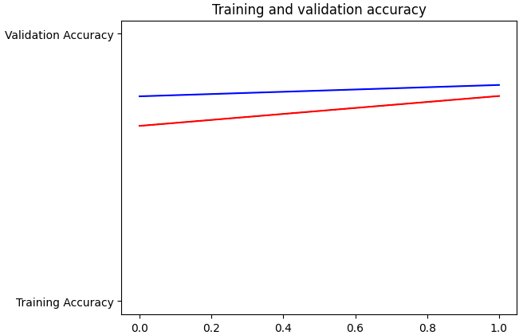

Train : data yang digunakan untuk training model, data sebaiknya sudah mewakili dari populasi

Valid : data yang digunakan untuk mengevaluasi kinerja model selama pelatihan. misalnya untuk mengetahui overfit model atau underfit model. 

data valid (validition) untuk kebutuhan evaluasi yang akan direpresentasikan dalam bentuk grafik sebagai berikut

split_size = .9 berarti split_size memiliki nilai 0.9, yang mengindikasikan bahwa proporsi data yang akan digunakan untuk pelatihan adalah 90%, sementara sisanya, yaitu 10%, akan digunakan untuk validasi.

Convolutional is a technique to extract features from an image. 