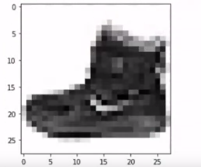
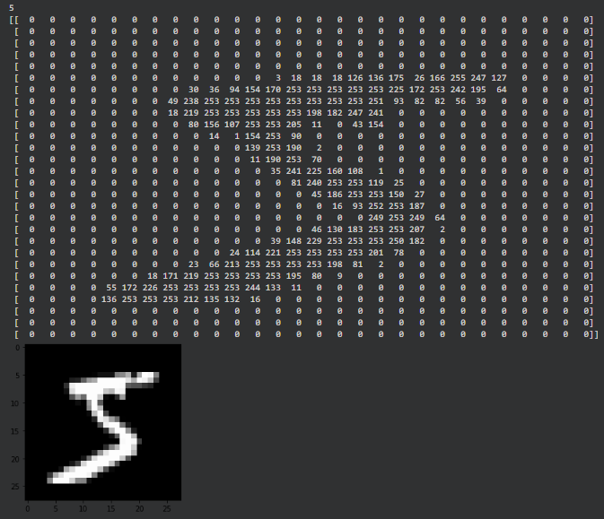

Computer vision algorithm explain in one image below:
the bite

the image

and for this

a one variable number represent one pixel how color is. 

1. Convolutions improve image recognition by isolate features in images. 
2. The Pooling technique do to the images is reduces information in them while maintaining some features
3. 

