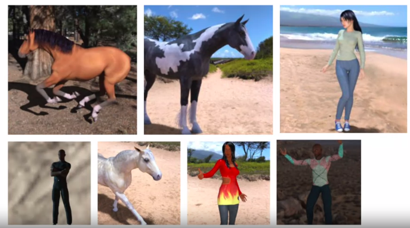

Images Data Generator

1. Using Image Generator, how do you label images:  It’s based on the directory the image is contained in
2. Rescale is method on the Image Generator is used to normalize the image
3. specify the training size for the images: The 'target_size' parameter on the training generator
4. If your training data is close to 1.000 accuracy, but your validation data isn’t, what’s the risk here :  You’re overfitting on your training data
5. Convolutional Neural Networks are better for classifying images like horses and humans because: In these images, the features may be in different parts of the frame,  There’s a wide variety of horses, There’s a wide variety of humans. 
6. After reducing the size of the images, the training results were different: We removed some convolutions to handle the smaller images