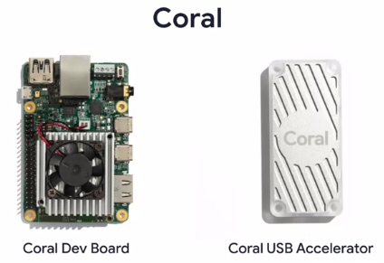
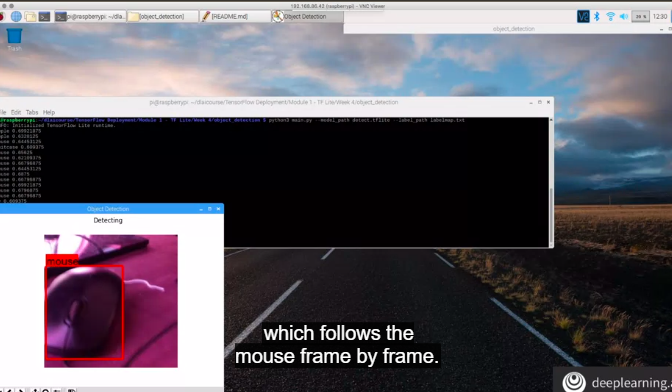
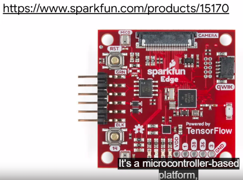
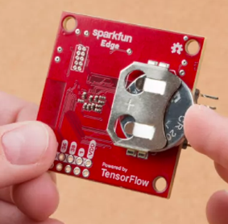

Tensorflow dapat diterapkan pada sistem android, browser, ios, dan beberapa jenis mikrokontroller. 

untuk mikrokontroller

rasberry Pi tidak hanya dapat digunakan untuk melakukan interference tetapi juga dapat untuk melatih model. 