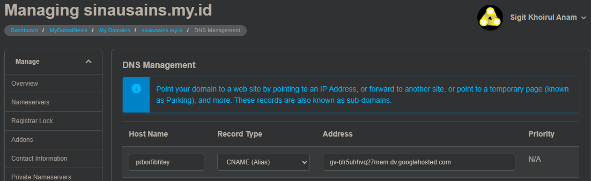
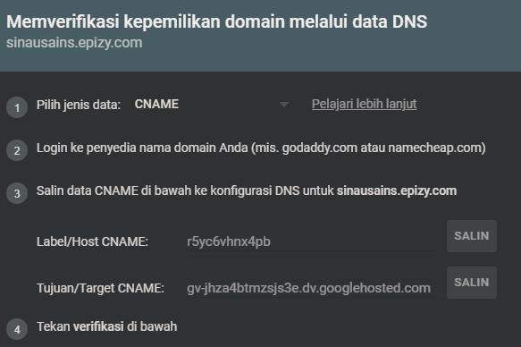
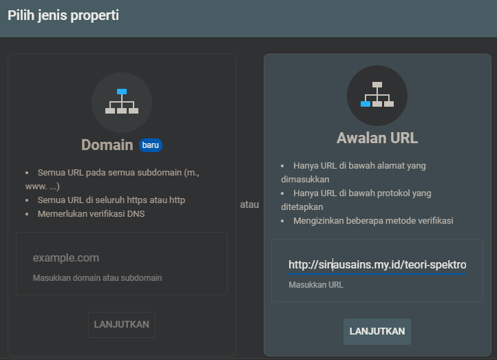
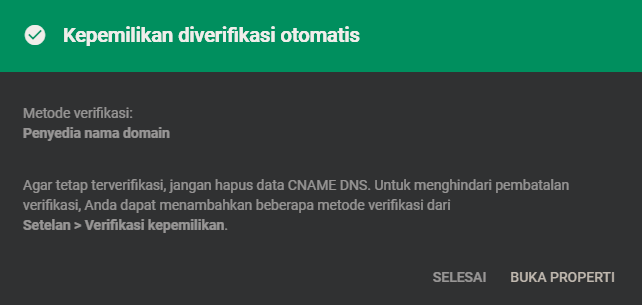

Google search console adalah tempat memverifikasi suatu web milik anda. berikut adalah beberapa metode yang dapat digunakan untuk memverifikasi

## 1. Melalui Domain
Melalui domain berarti anda akan perlu mengkonfigurasi di situs domain anda misalnya Domainesia. Dua cara yang bisa dicoba adalah dengan memilih jenis data CNAME dan TXT. disini akan dicontohkan untuk jenis data CNAME karena kemarin cara tersebut berhasil. 

pada situs domain anda tepatnya pada DNS management, tambahkan data CNAME, kemudian masukkan Host CNAME dan Target CNAME yang ditunjukkan seperti dibawah ini

tunggu beberapa jam, jika masih terkenda bisa menghubungi customer service penyedia halaman. jika sudah berhasil anda akan  bisa langsung memverifikasi tiap halaman lain yang menginduk pada sinausains.my.id yang telah diverifikasi terlebih dahulu seperti yang dicontohkan diatas. 

 
 

