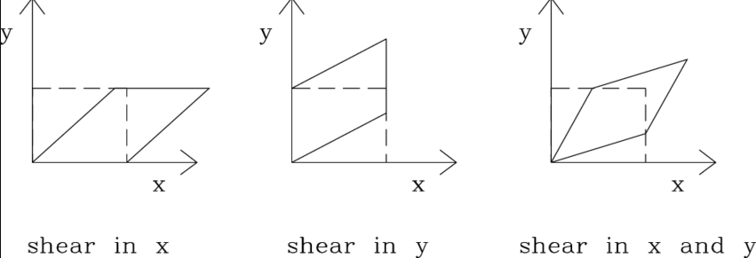
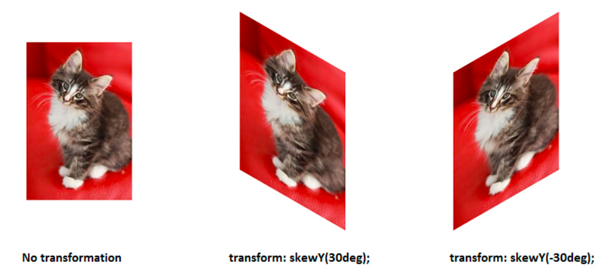
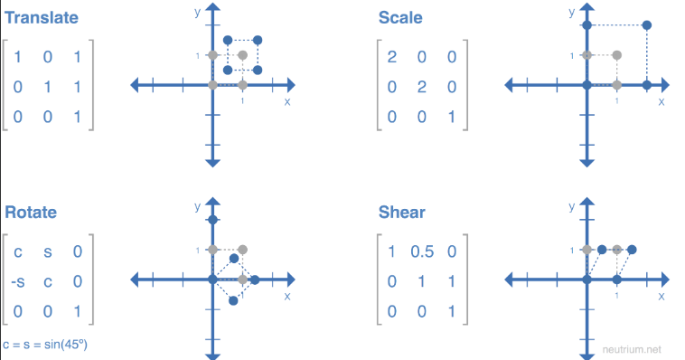

Pustaka seperti Pillow atau OpenCV juga biasanya memiliki fungsi untuk melakukan operasi "shearing" atau "skewing" pada gambar.

Shewing

Skewing

simulator online terdapat pada link berikut [*](https://web.ma.utexas.edu/users/ysulyma/matrix/)

manipulasi object dengan matrik

dapat dilihat bahwa untuk memperbesar (scale)
before:
|100|
|010|
|001|
after:
|200|
|020|
|001|

