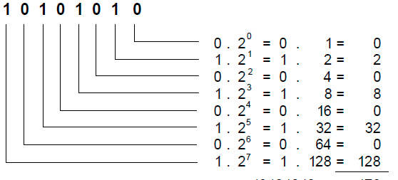
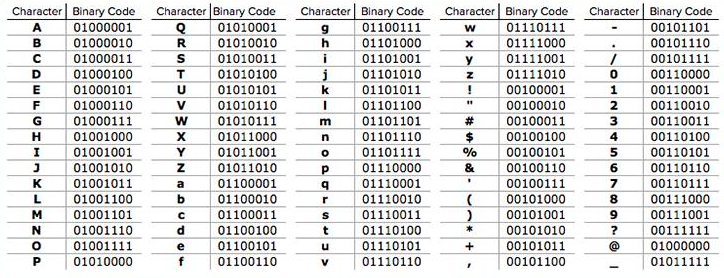

biner adalah kondisi antara 1 dan 0. biner 8-bit berarti memiliki panjang delapan biner, misal

00000000 apabila dikonversi ke desimal adalah bernilai 0

00000001 apabila dikonversi ke desimal adalah
bernilai 1

00000010 apabila dikonversi ke desimal adalah 
bernilai 2

00000011 apabila dikonversi ke desimal adalah bernilai 3

dimana pada prinsipnya, index pertama akan dikalikan dengan 2 dan diberi pangkat 0. index kedua akan dikalikan dengan 2 dan diberi pangkat 1. dan seterusnya.
> index pertama dimulai dari paling kanan.

 
kemudian bilangan tersebut diencode, misalnya dengan utf-8 untuk menjadikan suatu huruf

> biner memiliki dua kondisi yaitu 0 dan 1. Terinary memiliki tiga kondisi. Kuantum, komputer kuantum, memiliki dua kondisi. tetapi sejauh ini biner paling stabil untuk menyimpan data