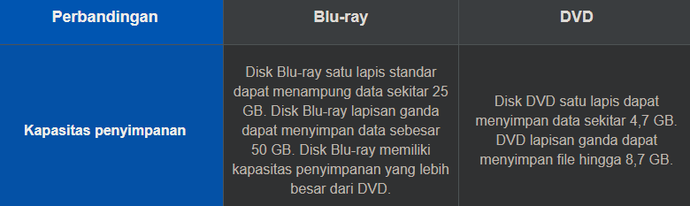
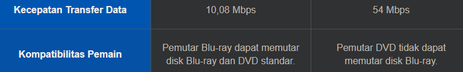

Saat ini, hampir semua film dan game baru disimpan oleh Blu-ray dan sepertinya Blu-ray telah sepenuhnya menggantikan DVD lama.

format disk optik baru yang terutama digunakan untuk memungkinkan perekaman dan penulisan ulang, memutar video definisi tinggi, dan menyimpan data dalam jumlah besar. jika DVD menggunakan sinar merah, maka blueray menggunakan sinar biru. 

di indonesia sepertinya masih sangat sedikit. PS3 sampai PS5 menggunakan teknologi ini, saat PS2 dikembangkan teknologi ini masih terstandarisasi sehingga PS2 masih menggunakan teknologi DVD.