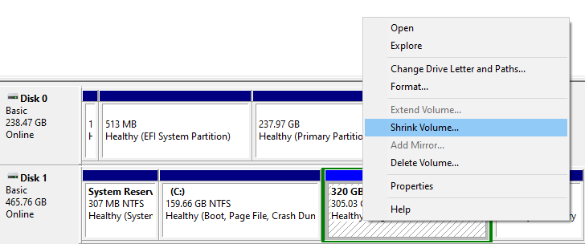

there is some partition type, ext4 and ntfs
linux sering menggukana ext4 dalam menggunkaan disk sedangkan windows menggunakan format disk ntfs. 

lewat CMD windows, mengubah ext4 menjadi ntfs tidak menghapus data, tetapi apabila dilakukan sebaliknya itu memerlukan pemformatan. 

alasan anda perlu mengubah menjadi ntfs adalah agar dapat 'shrink' volume yaitu menyediakan memori kosong (unallocated) untuk berbagai keperluan misalnya untuk mengistal dual OS

